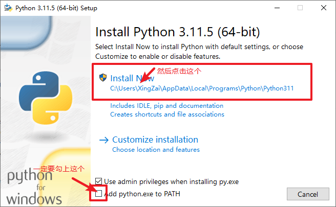
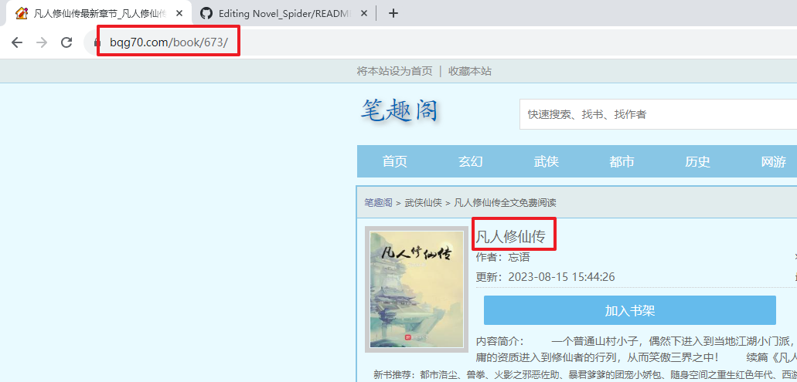

# Novel Spider 小说爬虫

> 小说爬虫，可以爬txt文件多个，单个txt文件和epub文件

互动界面为CLI也就是(Command Line Interface) 命令行界面，也就是cmd/shell的那种命令行，毕竟是突发奇想写的，自然是没有正常的UI的

## 使用方法

首先需要安装python，随便装个版本就行，3.10啊，3.11啊都是可以的

点击这个超链接就可以前往python的官网 [python官网](https://www.python.org/)

也可以点击这些链接快速下载

[Windows 3.11.5 x86架构64位 一般的windows都是这个](https://www.python.org/ftp/python/3.11.5/python-3.11.5-amd64.exe)

[Windows 3.11.5 x86架构32位 32位的老电脑的](https://www.python.org/ftp/python/3.11.5/python-3.11.5.exe)

[Windows 3.11.5 ram架构64位](https://www.python.org/ftp/python/3.11.5/python-3.11.5-arm64.exe)

[MacOS 3.11.5 通用版](https://www.python.org/ftp/python/3.11.5/python-3.11.5-macos11.pkg)

MacOS 指令(前提是你装了包管理器，比如brew之类的，我印象里Mac自带python来着的)

```shell
brew install python3
```

如果你是linux的话，(话说都用linux了能不会装python吗？一般都自带来着的)

Ubuntu系列的

```shell
sudo apt install python3
```

RedHat CentOS系列的

```shell
sudo yum install python3
```

安装的时候按照以下情况来



接下来就全部交给下一步，感觉自己懂一点的，就自己稍微调整调整，别到时候安装出问题了过来问我好吧

### 安装依赖

这个项目，太小了称不上项目，这个脚本说实话太简单了，就用了两个库，一个是requests，一个是ebook，安装依赖非常的简单，打开控制台，也就是windows的cmd和mac与linux的terminal

把路径加载到本项目处，输入

```shell
pip install -r requirements.txt
```

来安装依赖，反正就两个库，你直接安装库也可以，直接打开控制台然后输入

```shell
pip install requests
```

和

```shell
pip install EbookLib
```

v1.0.2新增

```shell
pip install tqdm
```

不出意外然后你就安装好依赖了，如果出现了问题比如下载的太慢啊，下载中断啊，那要么你挂梯子，要么你换源网上都搜得到的，搜pip换源，或者你直接点我这个链接去  
[pip 换源](https://zhuanlan.zhihu.com/p/551940762)

然后你把代码下载过去，接着windows用户双击 `win_start.bat`
就可以运行了，如果你是mac或者是linux，那就用shell脚本，也就是这个 `linux_and_mac_start.sh`
如果都不想，要自己运行，那windows用户就打开cmd加载有python脚本的这一文件夹下然后输入

```shell
python novel_spider.py
```

如果你是mac或者linux，同样用对应的控制台加载到对应的文件夹然后输入

```shell
python3 novel_spider.py
```

### 数据填写

如果你打开了文件，你可以和程序进行互动，假如你要爬书了，那就输入1，接下来会让你输入`book`的`id`，这个`book`的`id`
其实就是笔趣阁上的`book id`

如下


我们可以看到，找到我们要下载的书，然后我们看链接，在这个`book/`后面的这个数字就是`book`的`id`
，比如现在这本凡人修仙传，那他的`id`就是`673`，我们只需要给程序输入`673`，就可以下载了，另外下载的格式有三种

1. 第一种是多个txt文件，就是每一章分一个文件
2. 第二种是一整个小说全部放进一个txt文件里
3. 第三种就是把小说存入epub的电子书格式(这个格式可以放入apple自带的图书里)

假如你觉得用一些小说软件太多广告，正版的又太花钱，那你可以去寻找一个没有广告的txt阅读器，然后把第二种或者是第三种的格式导入进去即可。

话已至此，本项目仅供爬虫案例参考不要用于非法用途，如果有，与本人和本项目无关。

## 版本更新
* v1.0.4 
  * 更新了多线程爬虫，默认速度是之前版本的十倍
  * 修复了末尾多删一行的bug，可自行调整参数，建议不要太多不然会给封ip
  * 修复了在mac上无法创建epub的bug
  * 更改了部分异常处理的位置
  * 新增输入完id直接帮你查询是什么书籍
* v1.0.3 
  * 更新路径从原来放到文件等同路径变成了对应了路径，单个txt放入 `./single txt/` 下，依次类推， `./multi txt/`
    和 `./epub/`
* v1.0.2 
  * 更新部分文本
  * 加入进度条，比之前的可视化更好，即使在命令行提示里面也加入书名号，由于加入了进度条需要再安装一个库，如果运行不起来就再跟着readme走一遍。
* v1.0.1 
  * 修复windows无法写入 `/:*?"<>|\` 这些字符到文件名内的问题，替换成 `丿：星？'《》丨、`
